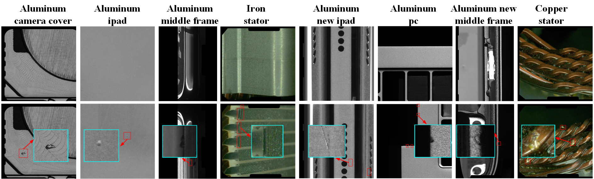
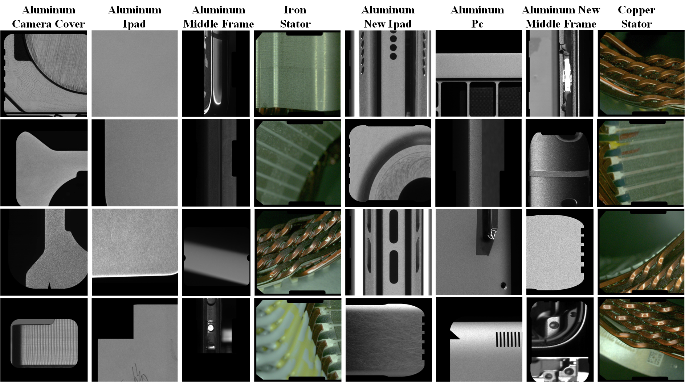
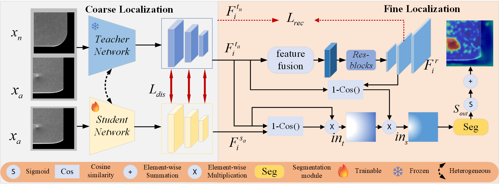

# 3CAD
[AAAI 2025] 3CAD: A Large-scale Real-World 3C product Dataset for Unsupervised Anomaly Detection

Enquan Yang\*, Peng Xing\*, Hanyang Sun, Wenbo Guo, Yuanwei Ma, Zechao Li, Dan Zeng

\*Denotes equal contribution

## 📜 Next Steps

- Update the dataset to cover more product categories and anomalies.
- Update the training weights of the comparison methods.
- Publish the full version of the paper, including supplementary materials, on arXiv.
- Explore potential collaborations or applications in related fields.
- Explore new model architectures to enhance the performance of 3CAD across multiple task formats.

## 📜 News
- **[2025-04-22]** We have updated the dataset by replacing Pinyin labels with English annotations for defect categories. 
- **[2025-01-06]** The dataset and code will be updated soon. 

## 👀 Overview
Industrial anomaly detection achieves progress thanks to datasets such as MVTec-AD and VisA. However, they suffer from limitations in terms of the number of defect samples, types of defects, and availability of real-world scenes. These constraints inhibit researchers from further exploring the performance of industrial detection with higher accuracy. To this end, we propose a new large-scale anomaly detection dataset called 3CAD, which is derived from real 3C production lines. Specifically, the proposed 3CAD includes eight different types of manufactured parts, totaling 27,039 high-resolution images labeled with pixel-level anomalies. The key features of 3CAD are that it covers anomalous regions of different sizes, multiple anomaly types, and the possibility of multiple anomalous regions and multiple anomaly types per anomaly image. This is the largest and first anomaly detection dataset dedicated to 3C product quality control for community exploration and development. Meanwhile, we introduce a simple yet effective framework for unsupervised anomaly detection: a Coarse-to-Fine detection paradigm with Recovery Guidance (CFRG). To detect small defect anomalies, the proposed CFRG utilizes a coarse-to-fine detection paradigm. Specifically, we utilize a heterogeneous distillation model for coarse localization and then fine localization through a segmentation model. In addition, to better capture normal patterns, we introduce recovery features as guidance. Finally,  we report the results of our CFRG framework and popular anomaly detection methods on the 3CAD dataset, demonstrating strong competitiveness and providing a highly challenging benchmark to promote the development of the anomaly detection field.

| Category | Training Images | Test Images (all) | Test Images (good) | Test Images (defect) | Defect types | Image Height | Image Width | NE / TE |
|:----------:|:-----------------:|:-------------------:|:--------------------:|:----------------------:|:--------------:|:--------------:|:-------------:|:---------:|
| ACC      | 784             | 1446              | 369                | 1077                 | 10           | 288~1024     | 288~1024    | 1\~6/1\~1 |
| AI       | 2096            | 2047              | 913                | 1134                 | 3            | 760~1024     | 600~1024    | 1\~10/1\~2|
| AMF      | 1548            | 1479              | 731                | 748                  | 5            | 540~1024     | 800~950     | 1\~9/1\~4 |
| ANMF     | 1072            | 1406              | 670                | 736                  | 6            | 400~1024     | 430~1024    | 1\~6/1\~2 |
| ANI      | 2233            | 4936              | 999                | 3937                 | 4            | 420~1024     | 580~1024    | 1\~23/1\~2|
| AP       | 1698            | 3161              | 911                | 2250                 | 14           | 430~1024     | 409~1024    | 1\~12/1\~3|
| CS       | 409             | 959               | 196                | 763                  | 1            | 1024~1024    | 1024~1024   | 1\~9/1\~1 |
| IS       | 653             | 1112              | 295                | 817                  | 4            | 1024~1024    | 1024~1024   | 1\~12/1\~2|
| All      | 10493           | 16546             | 5084               | 11462                | 47           | -            | -           | -       |

**Caption:** Statistical overview of the 3CAD dataset. The NE and TE in the last column indicate the number of anomalous regions and the number of anomalous types present in each defective image, respectively. ACC: Aluminum Camera Cover, AI: Aluminum Ipad, AMF: Aluminum Middle Frame, IS: Iron Stator, ANI: Aluminum New Ipad, AP: Aluminum Pc, ANMF: Aluminum New Middle Frame, and CS: Copper Stator.


## 📐 Dataset Examples
The data originates from high-quality segmentation datasets accumulated by the company over several years from various production line projects. It comprises 10,493 training images and 16,546 testing images that are carefully selected to represent the best acquisition for each product type.
<p align="center">
    
</p>

<p align="center">
    
</p>


## 🔮 Our Benchmark
<p align="center">
    
</p>

## 🚀 Evaluation Pipeline

### 2. Data Preparation
Prepare our processed visual anomaly detection datasets by following the instructions provided in the [README.md](train_utils/toolbox/datasets/README.md) file located in the datasets folder. 

### 3. Train
When changing the dataset, remember to modify the `item_list` in `train.py`.

Training 3CAD
```shell
CUDA_VISIBLE_DEVICES=0 python train.py --data-path 3cad_data_path --data-name 3CAD --model_name cfrg
```
Training MVTecAD
```shell
CUDA_VISIBLE_DEVICES=0 python train.py --data-path mvtec_data_path --data-name mvtec2d --model_name cfrg
```
### 4. Test
When changing the dataset, remember to modify the `item_list` in `test.py`.

Select the best model weights and place them in the `save_weights/` directory, then run the following command.
```shell
CUDA_VISIBLE_DEVICES=0 python test.py --data-path mvtec_data_path --data-name mvtec2d --model_name cfrg --weights weight_path
```
## 📊 Results
For benchmarking and performance comparison, we select embedding-based (E-b) methods; synthesis-based (A-syn) methods; reconstruction-based (R-b) method; and unified (U-ni) methods.

| **Category** | **Method**   | ACC       | AI        | AMF       | ANMF      | ANI       | AP        | CS       | IS       | Mean      |
|:------------:|:------------:|:---------:|:---------:|:---------:|:---------:|:---------:|:---------:|:--------:|:--------:|:---------:|
| **E-b**      | **PaDiM**    | 85.5/-    | 93.9/-    | 92.6/-    | 85.1/-    | 87.6/-    | 79.8/-    | 87.8/-   | 76.9/-   | 86.1/-    |
|              | **FastFlow** | 77.1/-    | 82.8/-    | 68.5/-    | 81.2/-    | 78.5/-    | 52.8/-    | 71.2/-   | 70.7/-   | 72.8/-    |
|              | **RD**       | 92.2/34.3 | 96.8/8.0  | 97.2/3.9  | 92.5/1.9  | 94.7/9.4  | 87.4/1.8  | 93.1/5.7 | 84.8/4.7 | 92.3/8.7  |
|              | **RD++**     | 91.1/32.9 | 96.6/5.1  | 97.4/5.3  | 91.6/2.0  | 95.4/12.5 | 85.5/1.6  | 93.1/6.8 | 84.9/4.6 | 91.9/8.8  |
|              | **SimpleNet**| 75.9/13.3 | 95.4/13.0 | 93.8/5.5  | 69.6/0.4  | 93.1/9.9  | 66.7/0.7  | 83.4/1.9 | 81.5/5.3 | 82.4/6.3  |
| **A-syn**    | **DREAM**    | 63.5/20.3 | 94.8/20.4 | 92.3/4.5  | 74.6/1.8  | 81.4/15.6 | 69.5/1.2  | 91.0/6.2 | 76.9/4.9 | 80.5/9.4  |
|              | **DeSTSeg**  | 87.8/32.5 | 96.9/12.5 | 96.6/4.1  | 94.8/5.8  | 93.2/9.2  | 77.1/2.2  | 90.8/3.1 | **86.9**/8.1 | 90.5/9.6  |
| **R-b**      | **RealNet**  | 81.0/-    | 92.4/-    | 89.3/-    | 82.9/-    | 89.8/-    | 76.0/-    | 81.1/-   | 78.3/-   | 83.8/-    |
| **U-ni**     | **UniAD**    | 84.7/-    | 94.6/-    | 93.5/-    | 88.0/-    | 86.0/-    | 81.4/-    | 85.1/-   | 80.9/-   | 86.8/-    |
|              | **CRAD**     | **92.9**/-| 96.7/-    | 97.0/-    | 90.8/-    | 92.8/-    | **88.4**/-| 91.0/-   | 86.4/-   | 92.0/-    |
| **E-b**      | **Ours**     | 91.1/**34.6** | **97.5/24.6** | **98.3/23.3** | **95.9/13.1** | **96.9/23.1** | 88.2/**2.5** | **93.5/10.2** | 85.9/**9.3** | **93.4/17.6** |

**Caption:** Performance of popular IAD algorithms and our paradigm on 3CAD. We report the P-AUROC (\%) and AP (\%) metrics for each class, along with the average across all classes. Higher values indicate better performance.

| **Category** | **Method**   | ACC       | AI        | AMF       | ANMF      | ANI       | AP        | CS       | IS       | Mean      |
|:------------:|:------------:|:---------:|:---------:|:---------:|:---------:|:---------:|:---------:|:--------:|:--------:|:---------:|
| **E-b**      | **PaDiM**    | 81.6/-    | **96.1/-**| 89.3/-    | 67.1/-    | 79.1/-    | 79.5/-    | 66.4/-   | 63.5/-   | 77.8/-    |
|              | **FastFlow** | 79.1/-    | 89.5/-    | 82.3/-    | 63.0/-    | 71.9/-    | 71.3/-    | 63.4/-   | 64.3/-   | 73.1/-    |
|              | **RD**       | 90.6/82.7 | 96.0/81.5 | 89.5/82.1 | 66.8/70.0 | 81.8/81.3 | 79.0/72.1 | 74.0/77.1| 65.9/60.8| 80.4/75.9 |
|              | **RD++**     | 92.0/83.2 | 95.5/86.5 | 89.0/84.0 | 70.0/65.7 | 81.8/85.2 | 80.5/70.8 | 76.3/**78.7**| 67.7/**63.8**| 81.6/77.2 |
|              | **SimpleNet**| 81.6/54.8 | 92.9/70.4 | 85.1/73.0 | 61.0/40.7 | 76.9/64.7 | 69.5/55.6 | 71.5/55.3| 67.2/54.6| 75.7/58.7 |
| **A-syn**    | **DREAM**    | 80.4/-    | 89.4/-    | 73.3/-    | 61.9/-    | 78.5/-    | 71.7/-    | 68.1/-   | 70.8/-   | 74.3/-    |
|              | **DeSTSeg**  | 91.9/79.7 | 95.1/93.5 | 93.1/85.9 | 77.3/81.3 | 87.5/75.1 | 85.6/77.7 | 70.4/66.5| **86.3**/60.0| 85.9/77.4 |
| **R-b**      | **RealNet**  | 83.9/43.3 | 90.7/70.4 | 73.9/38.1 | 66.6/27.7 | 70.0/22.2 | 70.4/40.1 | 65.2/47.6| 64.3/13.1| 73.1/37.8 |
| **U-ni**     | **UniAD**    | 82.4/-    | 93.3/-    | 87.4/-    | 65.5/-    | 86.4/-    | 72.4/-    | 56.8/-   | 62.4/-   | 75.8/-    |
|              | **CRAD**     | 88.2/-    | 92.6/-    | 89.4/-    | 69.0/-    | 75.6/-    | 82.7/-    | 72.6/-   | 64.2/-   | 79.3/-    |
| **E-b**      | **Ours**     | **93.9/84.6** | **96.1/91.8** | **94.5/90.6** | **83.8/82.4** | **90.7/88.4** | **87.2/78.5** | **77.2**/78.5| 68.4/61.3| **86.5/82.0** |

**Caption:** Performance of popular IAD algorithms and our paradigm on 3CAD. We report the I-AUROC (\%) and P-PRO (\%) metrics for each class, along with the average across all classes. Higher values indicate better performance.

## ⭐ BibTex Citation

If you find this paper and repository useful, please cite our paper☺️.

```BibTex

@inproceedings{Yang3CAD,
  title={3CAD: A Large-Scale Real-World 3C Product Dataset for Unsupervised Anomaly Detection},
  author={ Enquan Yang and Peng Xing and Hanyang Sun and Wenbo Guo and Yuanwei Ma and Zechao Li and Dan Zeng},
  year={2025},
}
